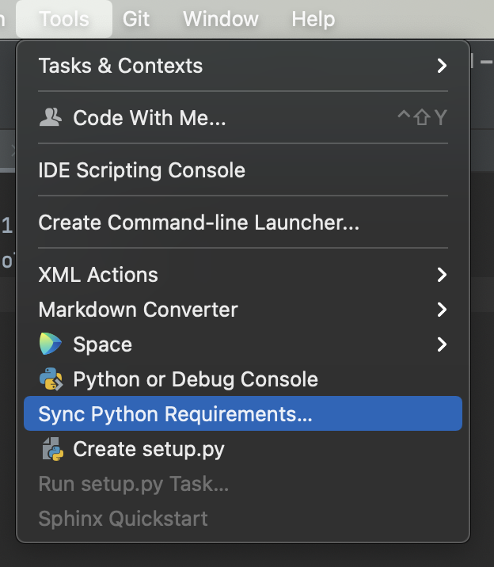

# Development

## Export Requirements

In order to run the tests automatically, we must have a `requirements.txt` file.

This code was edited in PyCharm. It is easy to automatically generate the file.



Commit this to the repository.

## Pylint

You may need to install Pylint in your virtual environment (venv).

`pip install pylint`

### Generate `.pylintrc`

To generate a `.pylintrc` file that can be used to set Pylint configurations...

```shell
pylint --generate-rcfile > .pylintrc
```